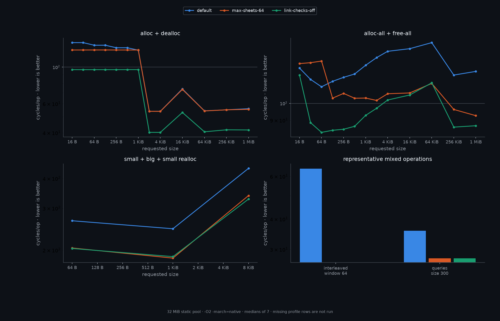
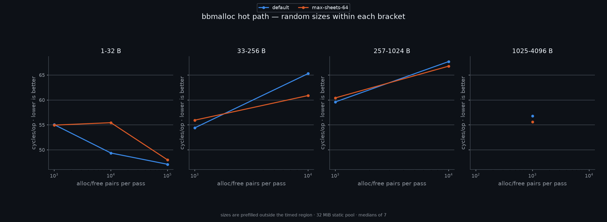
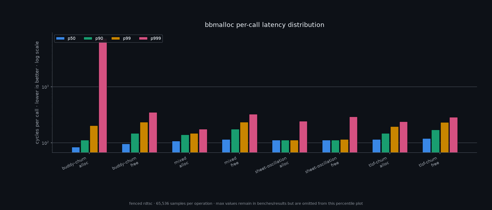

### *bbmalloc*

#### a deterministic, fixed-region memory allocator

<div align="left">

**bbmalloc** is a header-only C++23 general-purpose allocator for **bare-metal, no-MMU,
single-threaded targets** and small kernel heaps. It combines a bounded TLSF small-object tier
with a buddy allocator for larger blocks, using one or more caller-owned RAM regions.

</div>

<br clear="left"/>

[](#)

[](https://opensource.org/licenses/MIT)
[](https://en.cppreference.com/w/cpp/23)

------

> [!WARNING]
> bbmalloc is actively developed and its header-only API and layout may change. It is deliberately
> single-threaded: concurrent calls, interrupt-time re-entry, and calls made while another heap
> operation should be explicitly handled. 

#### Features

  - hybrid **TLSF + buddy** architecture: constant-time small-object placement and power-of-two
    large-block splitting/coalescing
  - **fixed-region ownership**: attach one or more RAM banks, with compile-time bounded metadata
  - **no-MMU capable**: no virtual-address reservation, paging, guard pages, syscalls, atomics,
    locks, thread-local state, or floating-point sizing in the allocator core
  - deterministic alignment and size introspection, including aligned allocation, resize, and
    `micron::__chunk<byte>` APIs
  - configurable static-pool, linker-pool, externally attached, and micron port-backed storage
  - optional **zero-on-alloc**, **zero-on-free**, poison-on-free, trailing redzones, and
    double-free diagnostics
  - optional allocation statistics and a C allocation shim for `malloc`, `calloc`, `realloc`,
    `free`, `aligned_alloc`, `posix_memalign`, `memalign`, `valloc`, and `pvalloc`
  - a micron-compatible allocator adapter for containers and other allocator-aware components
  - header-only, freestanding-capable, and dependent only on the lightweight micron core headers

------

##### Quickstart

Attach caller-owned memory and use the `bb` namespace directly:

```cpp
#include "src/bbmalloc.hpp"

alignas(4096) static byte heap[64u << 10];

int
main()
{
  if( !bb::attach(heap, sizeof(heap)) || !bb::init() )
    return 1;

  auto block = bb::balloc(128);
  if( block.ptr == nullptr )
    return 2;

  bb::dealloc(block.ptr);
  return bb::available() == bb::capacity() ? 0 : 3;
}
```

For a compile-time BSS pool, define `MICRON_BB_STATIC_POOL` before including the header or pass it
on the command line:

```sh
g++ -std=c++23 -O2 -Isrc -I/path/to/micron \
    -DMICRON_BB_STATIC_POOL=65536 app.cpp -o app
```

The first allocation lazily initializes the configured pool. `attach()` is the entry point for
external regions and may be called for up to `MICRON_BB_MAX_REGIONS` banks.

##### Design

bbmalloc routes requests by size and alignment. The exact boundaries are configuration-dependent;
the default small profile uses the following layout:

| tier | default range | strategy |
|---|---:|---|
| TLSF | 1 – 1 KiB | fixed-sheet TLSF blocks with 16-byte granularity |
| buddy | above 1 KiB | power-of-two blocks with split/coalesce |
| aligned buddy | any size requiring over-alignment | buddy block at the requested alignment |
| regions | up to 2 attached banks | bounded range ownership and per-region metadata |

Each region reserves a compact tag area and uses the remaining bytes as the data area. Buddy tags
record block starts and orders; TLSF sheets are buddy blocks containing their own free lists and
block-start bitmap. The allocator therefore needs no external page table, block-owner map, or
runtime-sized metadata structure.

##### Safety and hardening

The default failure policy returns a null result where possible. Compile-time options can add:

  - zero-filled allocation through `salloc`, `zalloc`, and `calloc`
  - overflow-checked `calloc`, aligned allocation, and resizing
  - trailing redzones with configurable report/refuse/halt behavior
  - poison-on-free and zero-on-free patterns
  - rejected foreign, stale, interior, and double-freed pointers
  - cumulative allocation counters through `MICRON_BB_STATS`

These checks are designed for fixed memory banks. They do not replace an MMU, guard pages, a
thread sanitizer, or interrupt masking.

##### Benchmarks

The benchmark suite measures bbmalloc profiles under the same fixed 32 MiB pool. It does not rank
bbmalloc against libc or desktop allocators: their virtual-memory and threading models are not
comparable to this allocator's target environment.

<picture>
  <source media="(prefers-color-scheme: dark)" srcset="benches/charts/size-operations-cycles.github.png">
  
</picture>

<picture>
  <source media="(prefers-color-scheme: dark)" srcset="benches/charts/hot-path-cycles.github.png">
  
</picture>

<picture>
  <source media="(prefers-color-scheme: dark)" srcset="benches/charts/latency-percentiles.github.png">
  
</picture>

Cycles per operation are **lower-is-better**. The size/operation figure covers round trips,
pool allocation/free, realloc, representative queries, and interleaved tier dispatch. The hot-path
figure compares the default eight-sheet profile with a 64-sheet profile; `link-checks-off` is shown
only as a code-size/performance diagnostic variant. The latency figure reports fenced `rdtsc`
percentiles over 65,536 samples per operation; maximum outliers remain in the raw result files.

The committed run uses an Intel Core i7-5960X, GCC 16.2.1, Linux 7.1.13, `taskset -c 3`,
`-O2 -march=native -fno-stack-protector -fno-lto`, two warmups, and medians of seven measured
passes. These are hosted x86-64 measurements, not promises about a particular microcontroller.
Reproduce them with:

```sh
ninja bbmalloc_benches
python3 scripts/run_benchmarks --cpu 3
python3 scripts/chart_benches --mode github
```

Raw, provenance-stamped text results live in `benches/results/`; generated images live in
`benches/charts/`.

##### Testing and validation

The repository contains focused smoke tests, allocator rigor tests, fuzz/model tests, hardening
tests, C-shim checks, hot-path code-generation gates, and freestanding cross-compilation cells.
Build the hosted suite with:

```sh
ninja bbmalloc_tests
```

The hosted test binaries use micron's inverted exit convention: **exit code 1 means pass**, while
ordinary examples return 0 on success. A complete local run can be checked with:

```sh
for t in bin/test_*; do
  test -x "$t" || continue
  case "$t" in
    *_top_only|*_neg_*) continue ;;
  esac
  "$t" >/dev/null 2>&1
  test "$?" -eq 1 || exit 1
done

ninja -k 0 bbmalloc_cross
```

The negative controls should fail deliberately: `bin/test_rigor_bb_buddy_top_only` and the
negative fuzz targets must return their documented failure code rather than pass silently.

------

##### API

All entry points live in `namespace bb`. The allocator uses micron's global `byte` and `usize`
aliases together with `micron::__chunk<byte>`.

```cpp
namespace bb {

// region lifecycle
bool attach(byte *ptr, usize len);
bool attach(byte *ptr, usize len, u8 *tags, usize tag_cap);
bool init();
void reset();                         // outstanding pointers become invalid

// allocation and chunks
byte *alloc(usize size);              // nullptr on failure
byte *salloc(usize size);             // zero-initialized allocation
micron::__chunk<byte> balloc(usize size);
micron::__chunk<byte> zalloc(usize size);
micron::__chunk<byte> fetch(usize size);  // zero-initialized chunk
template <typename T> T *fetch();
bool dealloc(void *ptr);
void dealloc(byte *ptr);

// aligned and resize operations
void *aligned_alloc(usize alignment, usize size);
micron::__chunk<byte> aligned_balloc(usize alignment, usize size);
void aligned_free(void *ptr);
micron::__chunk<byte> resize(micron::__chunk<byte> old,
                            usize size, usize preserve, usize alignment);

// introspection
usize query_size(const void *ptr);
bool is_present(const void *ptr);
bool within(const void *ptr);
usize musage();
usize available();
usize largest_free();
usize capacity();
u32 fragmentation_permille();
void which();

// optional counters, enabled with MICRON_BB_STATS
bb_stats stats();
void reset_stats();

// C-style names in namespace bb
void *malloc(usize size);
void *calloc(usize count, usize size);
void *realloc(void *ptr, usize size);
void free(void *ptr);

} // namespace bb
```

Define `BBMALLOC_C_SHIM` before including `src/bbmalloc.hpp` to additionally emit the global C
allocation symbols. The shim is opt-in so including bbmalloc does not unexpectedly replace the
host process allocator.

##### Configuration

`src/config.hpp` selects a complete profile through `BBMALLOC_CONFIG_HEADER`, `__BB_TINY`, or
`__BB_KERNEL`; otherwise it uses the small profile. The built-in profiles are:

| profile | minimum block | maximum region | regions | TLSF class | sheet | maximum sheets | maximum alignment |
|---|---:|---:|---:|---:|---:|---:|---:|
| tiny | 16 B | 256 KiB | 1 | 256 B | 4 KiB | 4 | 64 B |
| small | 32 B | 16 MiB | 2 | 1 KiB | 16 KiB | 8 | 4 KiB |
| kernel | 64 B | 1 GiB | 8 | 4 KiB | 64 KiB | 64 | 4 KiB |

The main compile-time knobs are:

```text
MICRON_BB_STATIC_POOL=<bytes>       BSS-backed pool
MICRON_BB_LINKER_POOL               __heap_start / __heap_end linker pool
MICRON_BB_PORT_POOL=<bytes>         one micron page-backed pool
MICRON_BB_PORT_GROW=<bytes>         growable micron-backed regions
MICRON_BB_MIN_BLOCK, _CLASS_SMALL, _SHEET, _MAX_SHEETS
MICRON_BB_MAX_REGIONS, _MAX_REGION_BYTES, _MAX_ALIGN
MICRON_BB_CACHE_CAP, _CACHE_MAX_ORDER
MICRON_BB_ZERO_ON_ALLOC, _ZERO_ON_FREE, _POISON_ON_FREE
MICRON_BB_REDZONE, _REDZONE_SIZE, _REDZONE_ACTION
MICRON_BB_DOUBLE_FREE_ACTION, _FAIL_RESULT, _LINK_CHECKS
MICRON_BB_STATS, _DEBUG_NOTICES
```

The profile headers document defaults and enforce geometry constraints with `static_assert`.
`MICRON_BB_STATS` is off by default; redzones, poisoning, zeroing, and diagnostic notices are
also opt-in because each changes the hot path or usable extent.

##### Building and integration

bbmalloc is header-only. Make the bbmalloc and micron source trees reachable, include
`src/bbmalloc.hpp`, and compile with the desired freestanding or hosted profile. The repository's
Ninja targets use `-Isrc -I/code/C++/micron`; the important targets are:

```sh
ninja bbmalloc_tests       # build hosted tests
ninja bbmalloc_cross       # freestanding/code-generation validation
ninja bbmalloc_benches     # build hosted benchmarks
```

For micron integration, select its barebones allocation path and provide a linker, static, or
port-backed pool appropriate to the target. For a standalone kernel or embedded heap, call
`attach()` with the linker-provided RAM range and keep calls serialized by the surrounding system.

##### Limitations

  - single-threaded by construction; concurrent calls and interrupt re-entry are undefined
  - no MMU-dependent features such as guard pages, `mprotect`, virtual-address reservation, or
    tombstoning
  - a region must be attached or configured through a supported pool source before allocation
  - `reset()` invalidates every outstanding pointer
  - alignment is limited by the profile and by the alignment actually achieved for an attached
    region
  - the first allocation pays lazy pool initialization cost
  - the allocator depends on micron's core type and port headers for its public types and hosted
    integration

------

#### License

Licensed under the MIT License.
